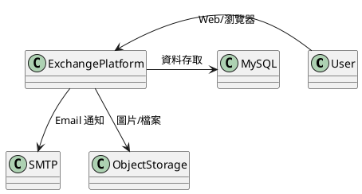
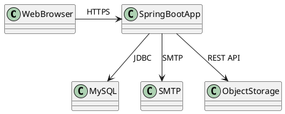
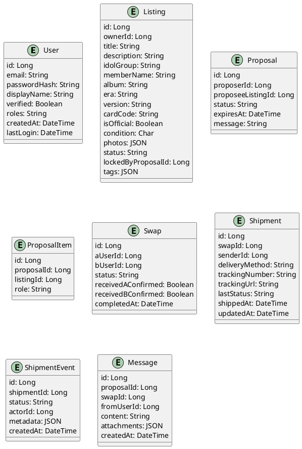
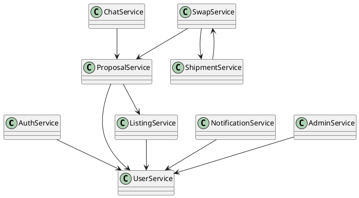
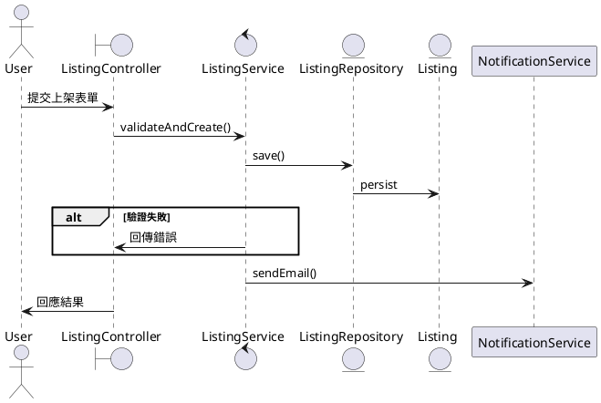
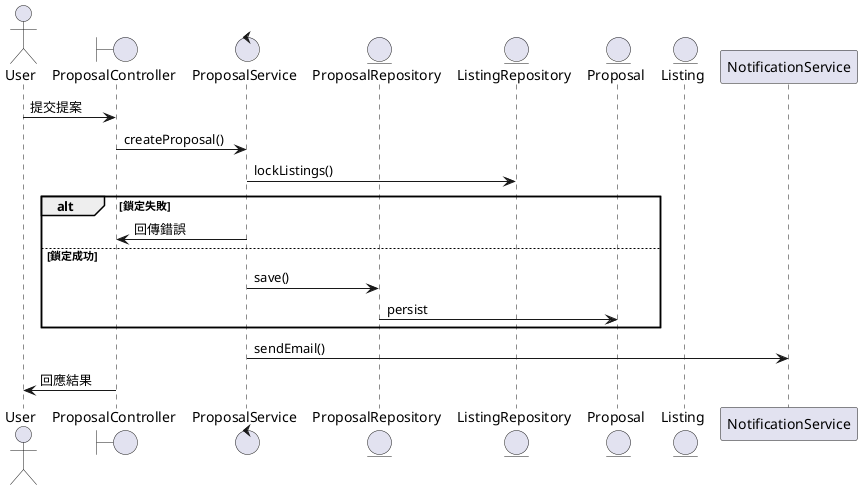
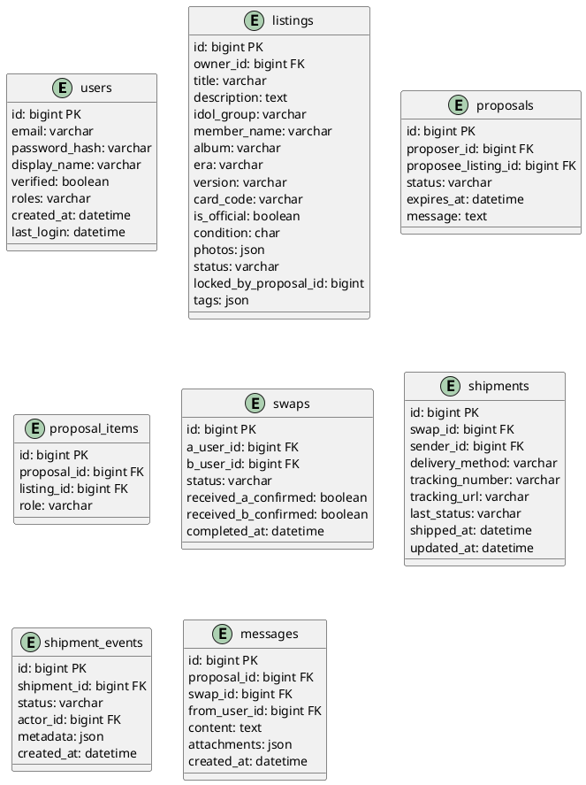

# 軟體架構設計文件（Software Architecture Design Document, SADD）

產品名稱：Exchange-Platform（明星小卡以物易物交換平台）  
版本：v0.1（草案）  
狀態：草擬中  
文件編號：SADD-EP-001  
參考文件：SRS、Use Cases、Entity 設計、程式碼、會議記錄

---

## 目錄
1. [簡介](#1-簡介)
2. [系統架構概觀](#2-系統架構概觀)
3. [模組設計（Module View）](#3-模組設計module-view)
4. [類別與資料設計（Logical View）](#4-類別與資料設計logical-view)
5. [關鍵流程設計（Process--Behavior-View）](#5-關鍵流程設計process--behavior-view)
6. [資料庫架構（Data View）](#6-資料庫架構data-view)
7. [跨模組設計議題](#7-跨模組設計議題)
8. [部署架構（Deployment View）](#8-部署架構deployment-view)
9. [品質屬性（Quality Attribute）](#9-品質屬性quality-attribute)
10. [風險與對策（Risk Management）](#10-風險與對策risk-management)

---

## 1. 簡介

### 1.1 文件目的
本文件依據 ISO/IEC/IEEE 42010 標準，完整記錄 Exchange-Platform 之軟體架構設計，作為開發、測試、維運與審查之依據。

### 1.2 文件使用範圍
適用於本專案全體開發人員、測試人員、維運人員、管理者及相關利害關係人。

### 1.3 系統背景摘要
Exchange-Platform 為明星小卡以物易物交換平台，支援用戶上架、提案、協商、出貨、追蹤、收貨等流程，並以分層式單體架構實作。

### 1.4 架構文件讀者與預期使用情境
- 系統架構師：審查設計決策與架構演進
- 開發人員：依據架構設計進行模組開發
- 測試/維運：理解系統組成與關聯，進行測試與維運
- 管理者/審查者：評估系統品質與風險

### 1.5 文件結構說明
本文件共十章，涵蓋系統架構、模組、類別、資料、流程、部署、品質、風險等，並附 PUML 圖表輔助說明。

---

## 2. 系統架構概觀

### 2.1 架構風格
- 分層式單體（Layered Monolithic Architecture）
- MVC（Model-View-Controller）
- RESTful API + WebSocket

### 2.2 系統邊界（System Context Diagram）


### 2.3 外部系統與依賴關係
- MySQL 8（資料庫）
- SMTP（Email 通知）
- 物件儲存（圖片/證據）
- 用戶端瀏覽器（Web）

### 2.4 執行環境架構（Runtime Architecture）
- Java 17+、Spring Boot 3.x
- 部署於 Linux VM 或雲端主機
- 依賴 MySQL、SMTP、物件儲存服務

### 2.5 Container Diagram


### 2.6 Deployment Diagram
```puml
@startuml Deployment
node "User PC" {
  [Web Browser]
}
node "App Server" {
  [Spring Boot App]
}
node "DB Server" {
  [MySQL]
}
node "Mail Server" {
  [SMTP]
}
node "Object Storage" {
  [Object Storage]
}
[Web Browser] --> [Spring Boot App] : HTTPS
[Spring Boot App] --> [MySQL] : JDBC
[Spring Boot App] --> [SMTP] : SMTP
[Spring Boot App] --> [Object Storage] : REST API
@enduml
```

---

## 3. 模組設計（Module View）

### 3.1 Auth Module
- 目的：用戶認證、授權、Session 管理
- 職責：登入、登出、密碼驗證、權限控管、CSRF 防護
- I/O：帳密、Session、Token
- 角色：User, Admin
- 資料表：users
- 類別：User, AuthService
- 耦合：User、Admin、Session

### 3.2 User Module
- 目的：用戶資料管理
- 職責：註冊、資料查詢、修改、驗證
- I/O：用戶資料表單、驗證信
- 角色：User, Admin
- 資料表：users
- 類別：User, UserService
- 耦合：Auth、Listing、Proposal

### 3.3 Listing Module
- 目的：小卡上架、管理
- 職責：建立、查詢、修改、刪除 listing
- I/O：listing 表單、圖片
- 角色：User, Admin
- 資料表：listings
- 類別：Listing, ListingService
- 耦合：User、Proposal、Admin

### 3.4 Proposal Module
- 目的：交換提案管理
- 職責：建立、查詢、回應提案
- I/O：提案資料、訊息
- 角色：User
- 資料表：proposals, proposal_items
- 類別：Proposal, ProposalItem, ProposalService
- 耦合：Listing、User、Negotiation

### 3.5 Negotiation/Chat Module
- 目的：協商與即時聊天
- 職責：WebSocket 訊息、訊息儲存
- I/O：訊息、聊天室
- 角色：User
- 資料表：messages
- 類別：Message, ChatService
- 耦合：Proposal、Swap

### 3.6 Swap Module
- 目的：交換成立與狀態管理
- 職責：建立 swap、狀態流轉、完成確認
- I/O：swap 狀態、確認
- 角色：User
- 資料表：swaps
- 類別：Swap, SwapService
- 耦合：Proposal、Shipment

### 3.7 Shipment Module
- 目的：出貨、追蹤、事件紀錄
- 職責：建立/更新 shipment、事件記錄
- I/O：出貨方式、運單號、事件
- 角色：User
- 資料表：shipments, shipment_events
- 類別：Shipment, ShipmentEvent, ShipmentService
- 耦合：Swap、User

### 3.8 Review Module
- 目的：用戶互評（未來擴充）
- 職責：評價、查詢
- I/O：評價表單
- 角色：User
- 資料表：reviews（假設）
- 類別：Review, ReviewService
- 耦合：User、Swap

### 3.9 Dispute Module
- 目的：爭議處理（未來擴充）
- 職責：申訴、仲裁
- I/O：申訴表單、證據
- 角色：User, Admin
- 資料表：disputes（假設）
- 類別：Dispute, DisputeService
- 耦合：User、Admin、Swap

### 3.10 Notification Module
- 目的：通知管理
- 職責：Email/站內通知
- I/O：通知內容
- 角色：User
- 資料表：無（或 email_notifications）
- 類別：NotificationService
- 耦合：User、Listing、Proposal、Swap

### 3.11 Admin Module
- 目的：後台管理
- 職責：用戶/上架審核、黑名單、仲裁
- I/O：審核表單、管理介面
- 角色：Admin
- 資料表：users, listings, disputes
- 類別：AdminService
- 耦合：User、Listing、Dispute

---

## 4. 類別與資料設計（Logical View）

### 4.1 Entity Class Diagram


### 4.2 Service Class Diagram


### 4.3 Entity 屬性說明
- 詳見 4.1 Entity Class Diagram
- 主要欄位皆有型別、約束（如 PK, FK, NotNull）

### 4.4 主要 Service 方法
- AuthService: login(), logout(), validateSession()
- UserService: register(), updateProfile(), getUserById()
- ListingService: createListing(), updateListing(), lockListing(), unlockListing()
- ProposalService: createProposal(), respondProposal(), lockListings()
- ChatService: sendMessage(), getMessagesByProposal()
- SwapService: createFromAcceptedProposal(), confirmReceived()
- ShipmentService: createShipment(), addEvent(), updateShipment()
- NotificationService: sendEmail(), sendInAppNotification()
- AdminService: approveListing(), blacklistUser(), arbitrateDispute()

### 4.5 Repository 功能
- 各 Entity 對應 Spring Data JPA Repository，支援 CRUD、條件查詢、分頁

---

## 5. 關鍵流程設計（Process / Behavior View）

### 5.1 UC-02 建立 Listing（含錯誤處理、Repository、Transaction）


### 5.2 UC-04 建立 Proposal（含鎖定、錯誤處理、Transaction）


---

## 6. 資料庫架構（Data View）

### 6.1 ER Diagram（PUML）


### 6.2 資料表說明
- 參見 6.1 ER Diagram
- 主要欄位、型別、PK/FK、約束皆標註於圖中

### 6.3 重要欄位與約束
- users.email 唯一
- listings.locked_by_proposal_id 為鎖定機制
- proposals.expires_at 控制提案有效期
- shipments.tracking_number 必填於交貨便

### 6.4 交易一致性策略
- 以 @Transactional 控制 Service 層交易
- 提案建立與 listing 鎖定同一 transaction
- Shipment event 寫入與狀態更新同一 transaction

---

## 7. 跨模組設計議題

### 7.1 認證 / 授權架構
- Spring Security + Session-Based
- 角色分級（User, Admin）
- 重要操作需權限驗證

### 7.2 Logging / Auditing
- SLF4J + Logback
- 重要操作（登入、提案、出貨）皆記錄審計日誌

### 7.3 例外處理策略
- ControllerAdvice 統一處理
- 回傳標準錯誤格式（code, message, details）

### 7.4 併發與鎖定策略
- listings.locked_by_proposal_id 作為 row-level lock
- 提案建立時鎖定，完成/失敗時釋放

### 7.5 API 安全性
- CSRF、XSS、SQLi 防護
- 上傳檔案大小、MIME 檢查

### 7.6 錯誤回覆格式
- JSON: { code, message, details }
- 頁面：顯示友善錯誤訊息

### 7.7 圖片上傳與風控
- 檔案大小限制、MIME 檢查、移除 EXIF
- 圖文檢測（移除聯絡資訊/價格）

### 7.8 會話管理（Session）
- Spring Session 管理
- 逾時自動登出

---

## 8. 部署架構（Deployment View）

### 8.1 Development Environment
- Windows/Mac/Linux
- Java 17+、Maven、MySQL、SMTP（可用 Mailtrap）

### 8.2 Local Deployment
- 單一 VM/PC 部署 Spring Boot + MySQL + SMTP
- 物件儲存可用本地目錄

### 8.3 Production Deployment
- 雲端 VM 部署 Spring Boot
- 雲端 MySQL、SMTP、物件儲存（如 AWS S3）
- 合理假設：單一應用伺服器，日後可橫向擴充

### 8.4 Deployment Diagram（PUML）
```puml
@startuml
node "User PC" {
  [Web Browser]
}
node "App Server" {
  [Spring Boot App]
}
node "DB Server" {
  [MySQL]
}
node "Mail Server" {
  [SMTP]
}
node "Object Storage" {
  [Object Storage]
}
[Web Browser] --> [Spring Boot App] : HTTPS
[Spring Boot App] --> [MySQL] : JDBC
[Spring Boot App] --> [SMTP] : SMTP
[Spring Boot App] --> [Object Storage] : REST API
@enduml
```

---

## 9. 品質屬性（Quality Attribute）

### 9.1 Performance
- 背景：需支援多用戶同時操作
- 設計策略：DB 索引、分頁查詢、快取
- 實作：MySQL 索引、Spring Cache
- 驗證：壓力測試、查詢分析

### 9.2 Reliability
- 背景：資料正確性與服務可用性
- 設計策略：交易一致性、例外處理
- 實作：@Transactional、審計日誌
- 驗證：異常測試、日誌審查

### 9.3 Security
- 背景：用戶資料與交易安全
- 設計策略：權限控管、加密、驗證
- 實作：Spring Security、BCrypt、CSRF
- 驗證：滲透測試、程式碼審查

### 9.4 Maintainability
- 背景：需求變動與維護成本
- 設計策略：分層、模組化、註解
- 實作：清楚分層、Service/Repository 分離
- 驗證：程式碼審查、維護紀錄

### 9.5 Scalability
- 背景：用戶數成長
- 設計策略：單體可橫向擴充、資料庫分離
- 實作：Stateless Controller、DB Pool
- 驗證：負載測試、橫向擴充演練

### 9.6 Usability
- 背景：用戶體驗
- 設計策略：簡潔 UI、表單驗證、錯誤提示
- 實作：Thymeleaf、Bootstrap、Bean Validation
- 驗證：用戶測試、回饋收集

---

## 10. 風險與對策（Risk Management）

| 風險編號 | 風險描述 | 影響 | 緩解策略 |
|---|---|---|---|
| R1 | 資料遺失 | 用戶損失、信任下降 | 定期備份、異地備援 |
| R2 | SQL Injection | 資料外洩 | 參數化查詢、驗證 |
| R3 | XSS 攻擊 | 用戶資料竄改 | 輸入/輸出過濾 |
| R4 | 密碼洩漏 | 帳號盜用 | 密碼雜湊、強制更換 |
| R5 | 併發鎖定失效 | 資料不一致 | Row-level lock、重試機制 |
| R6 | Email 未送達 | 通知失效 | 重送機制、監控 |
| R7 | 圖片含不當資訊 | 違規、下架 | 圖文檢測、審核 |
| R8 | 交易糾紛 | 信任受損 | 爭議處理、審核機制 |
| R9 | 服務中斷 | 用戶流失 | 健康檢查、備援 |
| R10 | 法規遵循不足 | 法律風險 | 定期審查、合規訓練 |

---

## 假設區
- Review/Dispute 模組僅預留，尚未實作
- 物件儲存可用 AWS S3 或本地目錄
- SMTP 可用 Mailtrap 或正式郵件服務
- 用戶數量、流量以中小型平台估算

---

（本文件為活文件，隨專案演進持續更新）
