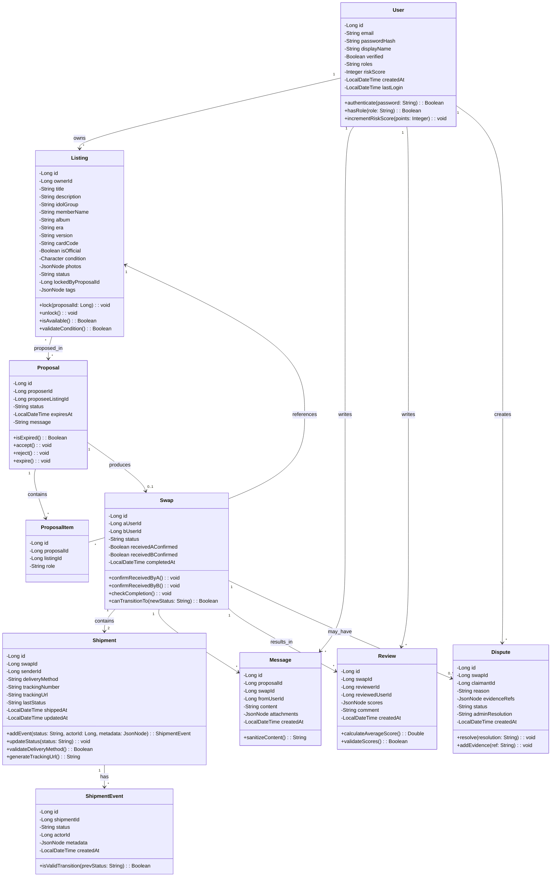
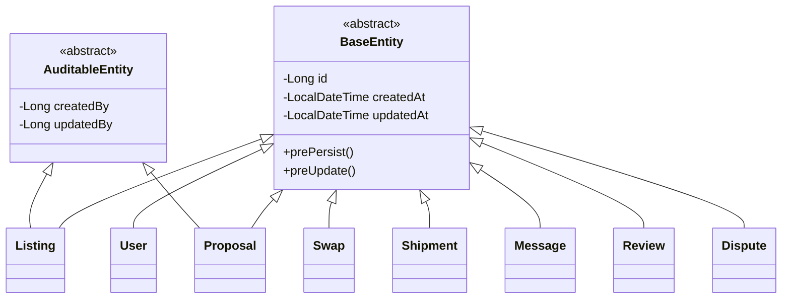
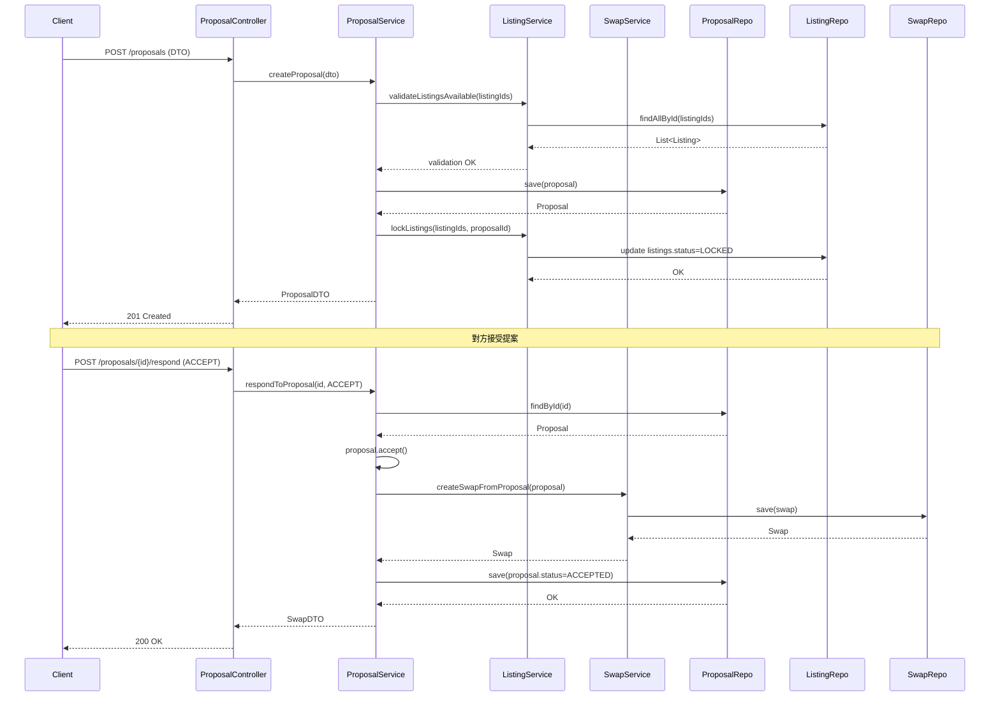
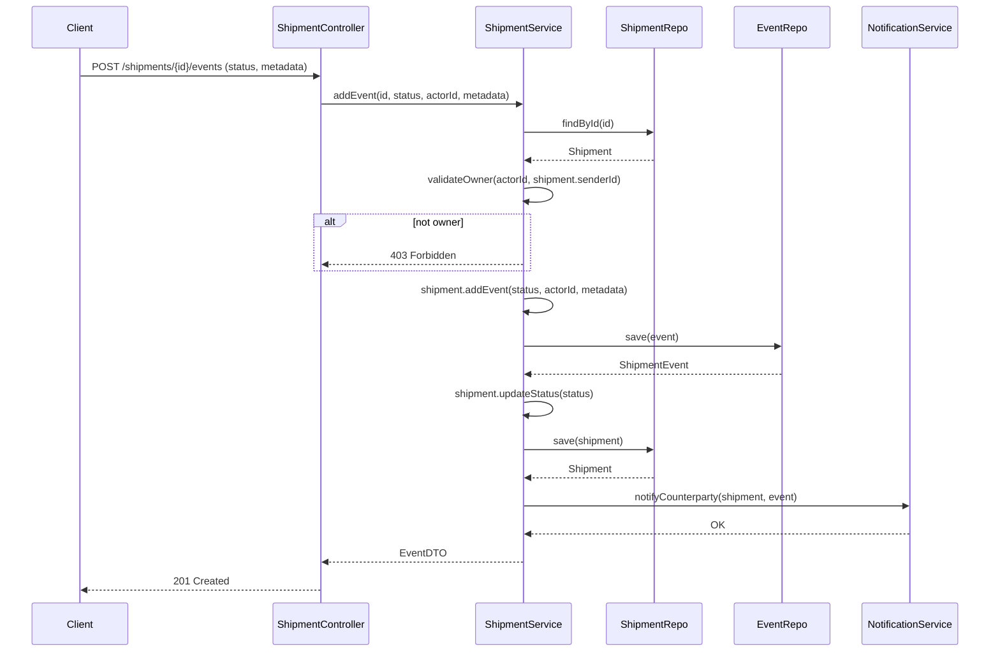
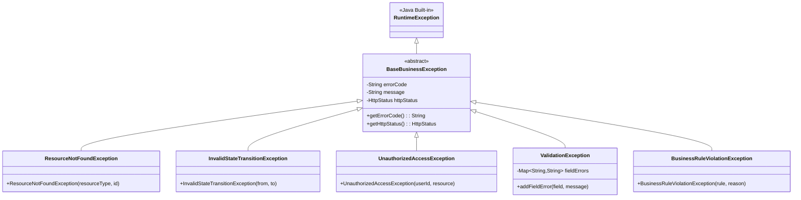

# 物件設計文件（Object Design Document, ODD）

產品：Exchange-Platform（明星小卡以物易物交換平台）  
版本：v0.1（草案）  
狀態：草擬中（與 SADD / SRS 同步演進）  
參考：docs/software-architecture-design.md、docs/software-requirements-specification.md

---

## 1. 物件導向模型

### 1.1 類別圖（Class Diagram）

本系統採用 Spring Boot + JPA 架構，以下為核心領域物件的類別圖（Mermaid）：



### 1.2 主要類別說明

#### 1.2.1 User（使用者）
**職責**：管理使用者身份、授權、風險評分  
**屬性**：
- `id`: 主鍵
- `email`: 登入帳號（唯一）
- `passwordHash`: BCrypt 加密密碼
- `displayName`: 顯示名稱
- `verified`: 郵件驗證狀態
- `roles`: 角色清單（ROLE_USER, ROLE_ADMIN）
- `riskScore`: 風險分數（UC-12）
- `createdAt`, `lastLogin`: 時間戳記

**主要方法**：
- `authenticate(password)`: 驗證密碼
- `hasRole(role)`: 檢查角色
- `incrementRiskScore(points)`: 增加風險分數

---

#### 1.2.2 Listing（上架小卡）
**職責**：管理小卡資訊、狀態、鎖定機制  
**屬性**：
- `id`: 主鍵
- `ownerId`: 外鍵 → User
- `title`, `description`: 基本資訊
- `idolGroup`, `memberName`, `album`, `era`, `version`, `cardCode`, `isOfficial`: 小卡專屬欄位
- `condition`: 品相（S/A/B/C）
- `photos`: JSON 陣列（圖片 URL）
- `status`: 狀態（AVAILABLE, LOCKED, SWAPPED）
- `lockedByProposalId`: 鎖定提案 ID
- `tags`: JSON 陣列

**主要方法**：
- `lock(proposalId)`: 鎖定小卡
- `unlock()`: 解鎖小卡
- `isAvailable()`: 是否可提案
- `validateCondition()`: 驗證品相合法性

---

#### 1.2.3 Proposal（交換提案）
**職責**：管理提案生命週期、過期邏輯  
**屬性**：
- `id`: 主鍵
- `proposerId`: 外鍵 → User（提案人）
- `proposeeListingId`: 外鍵 → Listing（被提案小卡）
- `status`: 狀態（PENDING, ACCEPTED, REJECTED, EXPIRED）
- `expiresAt`: 過期時間
- `message`: 提案訊息

**主要方法**：
- `isExpired()`: 檢查是否過期
- `accept()`: 接受提案（建立 Swap、鎖定小卡）
- `reject()`: 拒絕提案
- `expire()`: 過期處理（解鎖小卡）

---

#### 1.2.4 ProposalItem（提案項目）
**職責**：多卡提案的關聯表  
**屬性**：
- `id`: 主鍵
- `proposalId`: 外鍵 → Proposal
- `listingId`: 外鍵 → Listing
- `role`: 角色（OFFERED, REQUESTED）

---

#### 1.2.5 Swap（交換記錄）
**職責**：管理交換狀態機、收貨確認  
**屬性**：
- `id`: 主鍵
- `aUserId`, `bUserId`: 外鍵 → User（交換雙方）
- `status`: 狀態（INIT, IN_TRANSIT, AWAITING_CONFIRMATION, COMPLETED, DISPUTED, CANCELLED）
- `receivedAConfirmed`, `receivedBConfirmed`: 收貨確認
- `completedAt`: 完成時間

**主要方法**：
- `confirmReceivedByA()`, `confirmReceivedByB()`: 確認收貨
- `checkCompletion()`: 檢查雙方皆確認則標記 COMPLETED
- `canTransitionTo(newStatus)`: 驗證狀態轉換合法性

---

#### 1.2.6 Shipment（出貨記錄）
**職責**：管理物流資訊、手動追蹤  
**屬性**：
- `id`: 主鍵
- `swapId`: 外鍵 → Swap
- `senderId`: 外鍵 → User
- `deliveryMethod`: 配送方式（賣貨便, face_to_face）
- `trackingNumber`: 物流編號（賣貨便必填）
- `trackingUrl`: 查詢連結
- `lastStatus`: 最新狀態
- `shippedAt`, `updatedAt`: 時間戳記

**主要方法**：
- `addEvent(status, actorId, metadata)`: 新增物流事件
- `updateStatus(status)`: 更新最新狀態
- `validateDeliveryMethod()`: 驗證配送方式
- `generateTrackingUrl()`: 產生查詢連結（賣貨便）

---

#### 1.2.7 ShipmentEvent（物流事件）
**職責**：追蹤物流狀態變化歷程  
**屬性**：
- `id`: 主鍵
- `shipmentId`: 外鍵 → Shipment
- `status`: 狀態（PENDING, IN_TRANSIT, DELIVERED, RETURNED）
- `actorId`: 外鍵 → User（操作人）
- `metadata`: JSON（備註、證據連結）
- `createdAt`: 時間戳記

**主要方法**：
- `isValidTransition(prevStatus)`: 驗證狀態轉換

---

#### 1.2.8 Message（聊天訊息）
**職責**：協商聊天記錄  
**屬性**：
- `id`: 主鍵
- `proposalId`, `swapId`: 外鍵（聊天室綁定）
- `fromUserId`: 外鍵 → User
- `content`: 訊息內容
- `attachments`: JSON 陣列（圖片連結）
- `createdAt`: 時間戳記

**主要方法**：
- `sanitizeContent()`: 過濾聯絡資訊/價格

---

#### 1.2.9 Review（評價）
**職責**：管理評分與評論  
**屬性**：
- `id`: 主鍵
- `swapId`: 外鍵 → Swap
- `reviewerId`: 外鍵 → User（評價人）
- `reviewedUserId`: 外鍵 → User（被評價人）
- `scores`: JSON 物件 `{"packaging": 5, "speed": 4, "communication": 5}`
- `comment`: 評論
- `createdAt`: 時間戳記

**主要方法**：
- `calculateAverageScore()`: 計算平均分
- `validateScores()`: 驗證分數範圍（1-5）

---

#### 1.2.10 Dispute（爭議）
**職責**：管理爭議申訴與仲裁  
**屬性**：
- `id`: 主鍵
- `swapId`: 外鍵 → Swap
- `claimantId`: 外鍵 → User（申訴人）
- `reason`: 爭議原因
- `evidenceRefs`: JSON 陣列（證據連結）
- `status`: 狀態（OPEN, UNDER_REVIEW, RESOLVED）
- `adminResolution`: 管理員裁定
- `createdAt`: 時間戳記

**主要方法**：
- `resolve(resolution)`: 管理員裁定
- `addEvidence(ref)`: 新增證據

---

## 2. 物件關聯設計

### 2.1 繼承關係

本系統採用組合優於繼承原則，無深度繼承結構。但有以下抽象基礎：



**說明**：
- `BaseEntity`：提供 `id`, `createdAt`, `updatedAt` 與 JPA 生命週期 hook（`@PrePersist`, `@PreUpdate`）
- `AuditableEntity`：延伸 `BaseEntity`，新增 `createdBy`, `updatedBy`（需稽核的實體）

### 2.2 聚合/組合關係

#### 聚合（Aggregation）
- **User ◇—→ Listing**：使用者擁有多個上架小卡；小卡可獨立存在
- **Proposal ◇—→ ProposalItem**：提案包含多個項目；項目記錄獨立留存

#### 組合（Composition）
- **Swap ◆—→ Shipment**：Swap 擁有 Shipment；Swap 刪除時 Shipment 級聯刪除（`CascadeType.ALL, orphanRemoval=true`）
- **Shipment ◆—→ ShipmentEvent**：Shipment 擁有 Event；Shipment 刪除時 Event 級聯刪除
- **Swap ◆—→ Message**：Swap 聊天室訊息；Swap 刪除時訊息可選擇性保留或級聯刪除（依業務需求）

---

## 3. 介面與類別互動

### 3.1 主要互動流程：建立提案 → 接受 → 建立 Swap



### 3.2 主要互動流程：手動更新物流狀態



### 3.3 協作圖（Collaboration Diagram）：確認收貨

```mermaid
graph LR
  Client((Client))
  SwapCtrl[SwapController]
  SwapSvc[SwapService]
  SwapRepo[(SwapRepo)]
  NotifSvc[NotificationService]

  Client -->|1: POST /swaps/{id}/confirm_received| SwapCtrl
  SwapCtrl -->|2: confirmReceived(id, userId)| SwapSvc
  SwapSvc -->|3: findById(id)| SwapRepo
  SwapRepo -->|4: Swap| SwapSvc
  SwapSvc -->|5: swap.confirmReceivedByA() or B()| SwapSvc
  SwapSvc -->|6: swap.checkCompletion()| SwapSvc
  SwapSvc -->|7: save(swap)| SwapRepo
  SwapRepo -->|8: Swap| SwapSvc
  SwapSvc -->|9: notifyCompletion(swap)| NotifSvc
  SwapSvc -->|10: SwapDTO| SwapCtrl
  SwapCtrl -->|11: 200 OK| Client
```

---

## 4. 資料持久化設計

### 4.1 ORM Mapping（JPA Entity 摘要）

#### User Entity
```java
@Entity
@Table(name = "users", indexes = {
  @Index(name = "idx_email", columnList = "email", unique = true)
})
public class User extends BaseEntity {
  @Id
  @GeneratedValue(strategy = GenerationType.IDENTITY)
  private Long id;

  @Column(nullable = false, unique = true, length = 255)
  private String email;

  @Column(name = "password_hash", nullable = false, length = 255)
  private String passwordHash;

  @Column(name = "display_name", length = 100)
  private String displayName;

  @Column(nullable = false)
  private Boolean verified = false;

  @Column(length = 100)
  private String roles = "ROLE_USER";

  @Column(name = "risk_score")
  private Integer riskScore = 0;

  @Column(name = "last_login")
  private LocalDateTime lastLogin;

  @OneToMany(mappedBy = "owner", cascade = CascadeType.ALL)
  private List<Listing> listings = new ArrayList<>();

  // Getters, setters, business methods...
}
```

#### Listing Entity
```java
@Entity
@Table(name = "listings", indexes = {
  @Index(name = "idx_owner", columnList = "owner_id"),
  @Index(name = "idx_status", columnList = "status"),
  @Index(name = "idx_idol_group", columnList = "idol_group"),
  @Index(name = "idx_member_name", columnList = "member_name")
})
public class Listing extends BaseEntity {
  @Id
  @GeneratedValue(strategy = GenerationType.IDENTITY)
  private Long id;

  @ManyToOne(fetch = FetchType.LAZY)
  @JoinColumn(name = "owner_id", nullable = false)
  private User owner;

  @Column(nullable = false, length = 200)
  private String title;

  @Column(columnDefinition = "TEXT")
  private String description;

  @Column(name = "idol_group", length = 100)
  private String idolGroup;

  @Column(name = "member_name", length = 100)
  private String memberName;

  @Column(length = 100)
  private String album;

  @Column(length = 100)
  private String era;

  @Column(length = 50)
  private String version;

  @Column(name = "card_code", length = 50)
  private String cardCode;

  @Column(name = "is_official")
  private Boolean isOfficial = true;

  @Column(length = 1)
  private Character condition; // S, A, B, C

  @Type(JsonType.class)
  @Column(columnDefinition = "JSON")
  private JsonNode photos;

  @Column(length = 20)
  private String status = "AVAILABLE"; // AVAILABLE, LOCKED, SWAPPED

  @Column(name = "locked_by_proposal_id")
  private Long lockedByProposalId;

  @Type(JsonType.class)
  @Column(columnDefinition = "JSON")
  private JsonNode tags;

  // Business methods: lock(), unlock(), isAvailable()...
}
```

#### Proposal Entity
```java
@Entity
@Table(name = "proposals", indexes = {
  @Index(name = "idx_proposer", columnList = "proposer_id"),
  @Index(name = "idx_proposee_listing", columnList = "proposee_listing_id"),
  @Index(name = "idx_status", columnList = "status")
})
public class Proposal extends BaseEntity {
  @Id
  @GeneratedValue(strategy = GenerationType.IDENTITY)
  private Long id;

  @ManyToOne(fetch = FetchType.LAZY)
  @JoinColumn(name = "proposer_id", nullable = false)
  private User proposer;

  @ManyToOne(fetch = FetchType.LAZY)
  @JoinColumn(name = "proposee_listing_id", nullable = false)
  private Listing proposeeListing;

  @Column(length = 20)
  private String status = "PENDING"; // PENDING, ACCEPTED, REJECTED, EXPIRED

  @Column(name = "expires_at")
  private LocalDateTime expiresAt;

  @Column(columnDefinition = "TEXT")
  private String message;

  @OneToMany(mappedBy = "proposal", cascade = CascadeType.ALL, orphanRemoval = true)
  private List<ProposalItem> items = new ArrayList<>();

  @OneToOne(mappedBy = "proposal", cascade = CascadeType.ALL)
  private Swap swap;

  // Business methods: accept(), reject(), expire()...
}
```

#### Swap Entity
```java
@Entity
@Table(name = "swaps", indexes = {
  @Index(name = "idx_a_user", columnList = "a_user_id"),
  @Index(name = "idx_b_user", columnList = "b_user_id"),
  @Index(name = "idx_status", columnList = "status")
})
public class Swap extends BaseEntity {
  @Id
  @GeneratedValue(strategy = GenerationType.IDENTITY)
  private Long id;

  @ManyToOne(fetch = FetchType.LAZY)
  @JoinColumn(name = "a_user_id", nullable = false)
  private User userA;

  @ManyToOne(fetch = FetchType.LAZY)
  @JoinColumn(name = "b_user_id", nullable = false)
  private User userB;

  @Column(length = 30)
  private String status = "INIT"; // INIT, IN_TRANSIT, AWAITING_CONFIRMATION, COMPLETED, DISPUTED, CANCELLED

  @Column(name = "received_a_confirmed")
  private Boolean receivedAConfirmed = false;

  @Column(name = "received_b_confirmed")
  private Boolean receivedBConfirmed = false;

  @Column(name = "completed_at")
  private LocalDateTime completedAt;

  @OneToOne(fetch = FetchType.LAZY)
  @JoinColumn(name = "proposal_id")
  private Proposal proposal;

  @OneToMany(mappedBy = "swap", cascade = CascadeType.ALL, orphanRemoval = true)
  private List<Shipment> shipments = new ArrayList<>();

  @OneToMany(mappedBy = "swap", cascade = CascadeType.ALL)
  private List<Message> messages = new ArrayList<>();

  @OneToMany(mappedBy = "swap", cascade = CascadeType.ALL)
  private List<Review> reviews = new ArrayList<>();

  @OneToMany(mappedBy = "swap", cascade = CascadeType.ALL)
  private List<Dispute> disputes = new ArrayList<>();

  // Business methods: confirmReceivedByA(), checkCompletion()...
}
```

#### Shipment Entity
```java
@Entity
@Table(name = "shipments", indexes = {
  @Index(name = "idx_swap", columnList = "swap_id"),
  @Index(name = "idx_sender", columnList = "sender_id")
})
public class Shipment extends BaseEntity {
  @Id
  @GeneratedValue(strategy = GenerationType.IDENTITY)
  private Long id;

  @ManyToOne(fetch = FetchType.LAZY)
  @JoinColumn(name = "swap_id", nullable = false)
  private Swap swap;

  @ManyToOne(fetch = FetchType.LAZY)
  @JoinColumn(name = "sender_id", nullable = false)
  private User sender;

  @Column(name = "delivery_method", length = 20)
  private String deliveryMethod; // 賣貨便, face_to_face

  @Column(name = "tracking_number", length = 100)
  private String trackingNumber;

  @Column(name = "tracking_url", length = 500)
  private String trackingUrl;

  @Column(name = "last_status", length = 20)
  private String lastStatus = "PENDING";

  @Column(name = "shipped_at")
  private LocalDateTime shippedAt;

  @OneToMany(mappedBy = "shipment", cascade = CascadeType.ALL, orphanRemoval = true)
  private List<ShipmentEvent> events = new ArrayList<>();

  // Business methods: addEvent(), updateStatus(), generateTrackingUrl()...
}
```

#### ShipmentEvent Entity
```java
@Entity
@Table(name = "shipment_events", indexes = {
  @Index(name = "idx_shipment", columnList = "shipment_id")
})
public class ShipmentEvent extends BaseEntity {
  @Id
  @GeneratedValue(strategy = GenerationType.IDENTITY)
  private Long id;

  @ManyToOne(fetch = FetchType.LAZY)
  @JoinColumn(name = "shipment_id", nullable = false)
  private Shipment shipment;

  @Column(length = 20)
  private String status; // PENDING, IN_TRANSIT, DELIVERED, RETURNED

  @ManyToOne(fetch = FetchType.LAZY)
  @JoinColumn(name = "actor_id")
  private User actor;

  @Type(JsonType.class)
  @Column(columnDefinition = "JSON")
  private JsonNode metadata;

  // No setters for immutable event log
}
```

### 4.2 Repository 結構

所有 Repository 繼承 `JpaRepository` 與 `JpaSpecificationExecutor`（動態查詢）：

```java
public interface UserRepository extends JpaRepository<User, Long>, JpaSpecificationExecutor<User> {
  Optional<User> findByEmail(String email);
  List<User> findByRiskScoreGreaterThan(Integer threshold);
}

public interface ListingRepository extends JpaRepository<Listing, Long>, JpaSpecificationExecutor<Listing> {
  List<Listing> findByOwnerIdAndStatus(Long ownerId, String status);
  
  @Query("SELECT l FROM Listing l WHERE l.idolGroup = :group AND l.status = 'AVAILABLE'")
  List<Listing> findAvailableByIdolGroup(@Param("group") String idolGroup);
}

public interface ProposalRepository extends JpaRepository<Proposal, Long> {
  List<Proposal> findByProposerIdAndStatus(Long proposerId, String status);
  
  @Query("SELECT p FROM Proposal p WHERE p.expiresAt < :now AND p.status = 'PENDING'")
  List<Proposal> findExpiredProposals(@Param("now") LocalDateTime now);
}

public interface SwapRepository extends JpaRepository<Swap, Long> {
  List<Swap> findByUserAIdOrUserBId(Long userAId, Long userBId);
  
  @Query("SELECT s FROM Swap s WHERE s.status = 'AWAITING_CONFIRMATION' " +
         "AND s.receivedAConfirmed = true AND s.receivedBConfirmed = true")
  List<Swap> findCompletableSwaps();
}

public interface ShipmentRepository extends JpaRepository<Shipment, Long> {
  List<Shipment> findBySwapId(Long swapId);
  Optional<Shipment> findBySwapIdAndSenderId(Long swapId, Long senderId);
}

public interface ShipmentEventRepository extends JpaRepository<ShipmentEvent, Long> {
  List<ShipmentEvent> findByShipmentIdOrderByCreatedAtDesc(Long shipmentId);
}

public interface MessageRepository extends JpaRepository<Message, Long> {
  List<Message> findByProposalIdOrderByCreatedAtAsc(Long proposalId);
  List<Message> findBySwapIdOrderByCreatedAtAsc(Long swapId);
}

public interface ReviewRepository extends JpaRepository<Review, Long> {
  List<Review> findBySwapId(Long swapId);
  List<Review> findByReviewedUserId(Long userId);
}

public interface DisputeRepository extends JpaRepository<Dispute, Long> {
  List<Dispute> findBySwapId(Long swapId);
  List<Dispute> findByStatus(String status);
}
```

### 4.3 資料庫索引策略

| 資料表 | 索引欄位 | 用途 |
|---|---|---|
| users | email (UNIQUE) | 登入查詢 |
| listings | owner_id, status, idol_group, member_name | 搜尋/過濾 |
| proposals | proposer_id, status, expires_at | 提案管理/過期排程 |
| swaps | a_user_id, b_user_id, status | 使用者交易列表 |
| shipments | swap_id, sender_id | 物流查詢 |
| shipment_events | shipment_id, created_at | 事件時間序列 |
| messages | proposal_id, swap_id, created_at | 聊天室訊息 |
| reviews | swap_id, reviewed_user_id | 評價查詢 |
| disputes | swap_id, status | 爭議管理 |

---

## 5. 例外與錯誤處理策略

### 5.1 例外層次結構



### 5.2 例外定義範例

```java
// 基礎業務例外
public abstract class BaseBusinessException extends RuntimeException {
  private final String errorCode;
  private final HttpStatus httpStatus;

  public BaseBusinessException(String errorCode, String message, HttpStatus httpStatus) {
    super(message);
    this.errorCode = errorCode;
    this.httpStatus = httpStatus;
  }

  public String getErrorCode() { return errorCode; }
  public HttpStatus getHttpStatus() { return httpStatus; }
}

// 資源不存在
public class ResourceNotFoundException extends BaseBusinessException {
  public ResourceNotFoundException(String resourceType, Long id) {
    super("RESOURCE_NOT_FOUND", 
          String.format("%s with id %d not found", resourceType, id),
          HttpStatus.NOT_FOUND);
  }
}

// 狀態轉換非法
public class InvalidStateTransitionException extends BaseBusinessException {
  public InvalidStateTransitionException(String from, String to) {
    super("INVALID_STATE_TRANSITION",
          String.format("Cannot transition from %s to %s", from, to),
          HttpStatus.BAD_REQUEST);
  }
}

// 權限不足
public class UnauthorizedAccessException extends BaseBusinessException {
  public UnauthorizedAccessException(Long userId, String resource) {
    super("UNAUTHORIZED_ACCESS",
          String.format("User %d cannot access %s", userId, resource),
          HttpStatus.FORBIDDEN);
  }
}

// 驗證失敗
public class ValidationException extends BaseBusinessException {
  private Map<String, String> fieldErrors = new HashMap<>();

  public ValidationException(String message) {
    super("VALIDATION_ERROR", message, HttpStatus.BAD_REQUEST);
  }

  public void addFieldError(String field, String error) {
    fieldErrors.put(field, error);
  }

  public Map<String, String> getFieldErrors() { return fieldErrors; }
}

// 業務規則違反
public class BusinessRuleViolationException extends BaseBusinessException {
  public BusinessRuleViolationException(String rule, String reason) {
    super("BUSINESS_RULE_VIOLATION",
          String.format("Rule '%s' violated: %s", rule, reason),
          HttpStatus.UNPROCESSABLE_ENTITY);
  }
}
```

### 5.3 全域例外處理器

```java
@RestControllerAdvice
public class GlobalExceptionHandler {

  @ExceptionHandler(ResourceNotFoundException.class)
  public ResponseEntity<ErrorResponse> handleResourceNotFound(ResourceNotFoundException ex) {
    ErrorResponse error = new ErrorResponse(
      ex.getErrorCode(),
      ex.getMessage(),
      LocalDateTime.now()
    );
    return ResponseEntity.status(ex.getHttpStatus()).body(error);
  }

  @ExceptionHandler(InvalidStateTransitionException.class)
  public ResponseEntity<ErrorResponse> handleInvalidStateTransition(InvalidStateTransitionException ex) {
    ErrorResponse error = new ErrorResponse(
      ex.getErrorCode(),
      ex.getMessage(),
      LocalDateTime.now()
    );
    return ResponseEntity.status(ex.getHttpStatus()).body(error);
  }

  @ExceptionHandler(UnauthorizedAccessException.class)
  public ResponseEntity<ErrorResponse> handleUnauthorizedAccess(UnauthorizedAccessException ex) {
    ErrorResponse error = new ErrorResponse(
      ex.getErrorCode(),
      ex.getMessage(),
      LocalDateTime.now()
    );
    return ResponseEntity.status(ex.getHttpStatus()).body(error);
  }

  @ExceptionHandler(ValidationException.class)
  public ResponseEntity<ValidationErrorResponse> handleValidation(ValidationException ex) {
    ValidationErrorResponse error = new ValidationErrorResponse(
      ex.getErrorCode(),
      ex.getMessage(),
      ex.getFieldErrors(),
      LocalDateTime.now()
    );
    return ResponseEntity.status(ex.getHttpStatus()).body(error);
  }

  @ExceptionHandler(BusinessRuleViolationException.class)
  public ResponseEntity<ErrorResponse> handleBusinessRuleViolation(BusinessRuleViolationException ex) {
    ErrorResponse error = new ErrorResponse(
      ex.getErrorCode(),
      ex.getMessage(),
      LocalDateTime.now()
    );
    return ResponseEntity.status(ex.getHttpStatus()).body(error);
  }

  @ExceptionHandler(MethodArgumentNotValidException.class)
  public ResponseEntity<ValidationErrorResponse> handleMethodArgumentNotValid(MethodArgumentNotValidException ex) {
    Map<String, String> fieldErrors = new HashMap<>();
    ex.getBindingResult().getFieldErrors().forEach(error -> 
      fieldErrors.put(error.getField(), error.getDefaultMessage())
    );
    
    ValidationErrorResponse error = new ValidationErrorResponse(
      "VALIDATION_ERROR",
      "Request validation failed",
      fieldErrors,
      LocalDateTime.now()
    );
    return ResponseEntity.status(HttpStatus.BAD_REQUEST).body(error);
  }

  @ExceptionHandler(Exception.class)
  public ResponseEntity<ErrorResponse> handleGenericException(Exception ex) {
    // Log full stack trace for debugging
    log.error("Unexpected error", ex);
    
    ErrorResponse error = new ErrorResponse(
      "INTERNAL_ERROR",
      "An unexpected error occurred",
      LocalDateTime.now()
    );
    return ResponseEntity.status(HttpStatus.INTERNAL_SERVER_ERROR).body(error);
  }
}
```

### 5.4 Service 層例外使用範例

```java
@Service
@Transactional
public class ShipmentService {

  public ShipmentEvent addEvent(Long shipmentId, String status, Long actorId, JsonNode metadata) {
    // 1. 查找資源
    Shipment shipment = shipmentRepository.findById(shipmentId)
      .orElseThrow(() -> new ResourceNotFoundException("Shipment", shipmentId));

    // 2. 權限驗證
    if (!shipment.getSender().getId().equals(actorId)) {
      throw new UnauthorizedAccessException(actorId, "Shipment " + shipmentId);
    }

    // 3. 業務規則驗證
    if (!isValidStatusTransition(shipment.getLastStatus(), status)) {
      throw new InvalidStateTransitionException(shipment.getLastStatus(), status);
    }

    if ("賣貨便".equals(shipment.getDeliveryMethod()) && shipment.getTrackingNumber() == null) {
      throw new BusinessRuleViolationException(
        "TRACKING_NUMBER_REQUIRED",
        "Tracking number must be provided for 賣貨便 delivery"
      );
    }

    // 4. 執行業務邏輯
    ShipmentEvent event = shipment.addEvent(status, actorId, metadata);
    shipmentEventRepository.save(event);
    
    shipment.updateStatus(status);
    shipmentRepository.save(shipment);

    return event;
  }
}
```

### 5.5 錯誤回應 DTO

```java
public class ErrorResponse {
  private String errorCode;
  private String message;
  private LocalDateTime timestamp;

  // Constructors, getters, setters...
}

public class ValidationErrorResponse extends ErrorResponse {
  private Map<String, String> fieldErrors;

  // Constructors, getters, setters...
}
```

---

## 6. 設計原則與最佳實踐

### 6.1 SOLID 原則應用
- **單一職責（SRP）**：每個 Entity 僅負責自身狀態與基本業務邏輯；複雜流程交由 Service 層
- **開閉原則（OCP）**：狀態機驗證可擴充（策略模式）；新增物流方式無需修改核心邏輯
- **里氏替換（LSP）**：BaseEntity 子類別可互換使用
- **介面隔離（ISP）**：Repository 僅暴露必要查詢方法
- **依賴反轉（DIP）**：Service 依賴 Repository 介面，非具體實作

### 6.2 交易管理
- Service 層方法標註 `@Transactional`
- 跨多個 Entity 的操作（如建立 Swap + 鎖定 Listing）包在單一 Service 方法內確保原子性
- 讀取用 `@Transactional(readOnly = true)` 優化效能

### 6.3 延遲載入與 N+1 問題
- 使用 `@EntityGraph` 或 `JOIN FETCH` 預載關聯
- DTO Projection 避免載入完整 Entity

### 6.4 審計與日誌
- `BaseEntity` 與 `AuditableEntity` 提供自動時間戳記與操作人記錄
- 關鍵業務操作（提案接受、爭議裁定）寫入審計日誌表（未來擴充）

---

本文件為活文件。類別設計若與資料庫 ER Diagram 或 SADD 有出入，以最新 SADD 與 SRS 為準，並同步更新本文件。
