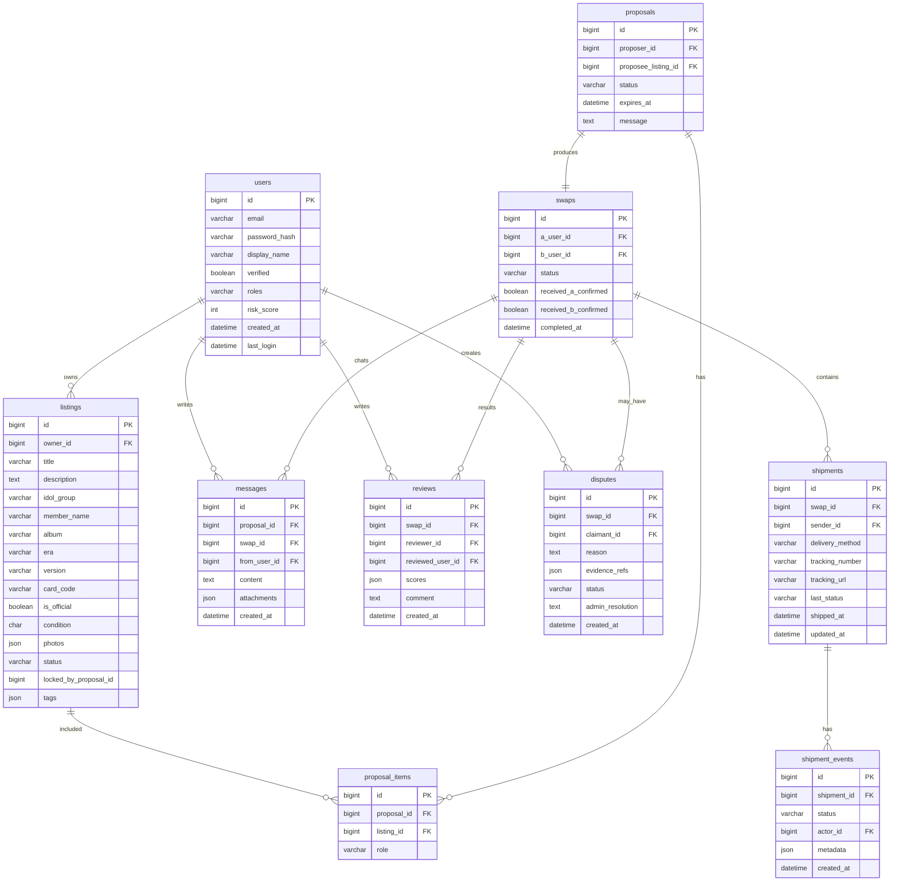

# 軟體設計文件（Software Architecture Design Document, SADD）

產品：Exchange-Platform（明星小卡以物易物交換平台）
版本：v0.1（草案）
狀態：草擬中（與 SRS / Use Cases 同步演進）
參考：docs/software-requirements-specification.md、docs/use-cases/*、docs/use-cases/state-indicators.md

## 1. 系統概觀

### 1.1 架構風格
- 分層式單體（Layered Monolith）
	- 表現層（Presentation）：Spring MVC + Thymeleaf（SSR）
	- 應用/網域層（Application/Domain）：Service 與 Domain 物件實作交換規則（提案、鎖定、出貨、手動追蹤、收貨確認、評價、爭議）
	- 資料存取層（Persistence）：Spring Data JPA（Hibernate）對 MySQL
- 即時通訊（可選）：Spring WebSocket + STOMP（UC-05 協商聊天）
- 通知：Email（SMTP）
- 檔案儲存：小卡照片/證據圖檔（開發可本機，正式建議物件儲存）

選擇理由：
- 與 Thymeleaf SSR 相容、開發效率高、Session-based 安全性好；單體便於小團隊快速迭代，後續可演進服務化

### 1.2 系統整體運作圖（System Architecture Diagram）
```mermaid
flowchart LR
  A[瀏覽器<br/>"(Thymeleaf SSR + JS)"] <-->|HTTPS| B[Spring Boot 應用<br/>MVC / Security / WebSocket]
  B --> C[Service 層]
  C --> D["(MySQL 8)"]
  C --> E["(物件儲存"<br/>"(圖片/證據))"]
  C --> F[SMTP/Email]
  B --- G["(WebSocket/STOMP)"]
```

## 2. 模組分解

### 2.1 模組與職責
- Auth（身份與授權）
	- Spring Security、Session-Based Login、BCrypt 密碼、CSRF 防護
	- 角色：ROLE_USER、ROLE_ADMIN；登入/登出/忘記密碼/郵件驗證
- User/Profile（使用者與偏好）
	- 使用者資料、風險分數與限制旗標（UC-12）
- Listings（上架與小卡資料）
	- 小卡欄位：idol_group, member_name, album/era, version, card_code, is_official, condition(S/A/B/C)
	- 圖片上傳、（可選）內容檢測（移除聯絡資訊/廣告）
- Proposal（交換提案）
	- 多卡提案、鎖定 listing、過期（expiresAt）與解鎖
- Negotiation/Chat（協商聊天）
	- WebSocket/STOMP 訊息，房間以 proposalId 區分；訊息落庫
- Swap（交換記錄）
	- 提案雙方同意後建立；狀態機管理（INIT → IN_TRANSIT → AWAITING_CONFIRMATION → COMPLETED/…）
- Shipment（出貨與手動追蹤）
	- delivery_method ∈ {賣貨便, face_to_face}；賣貨便需 tracking_number
	- shipment.events 與 last_status 由寄件人手動更新；UI 顯示查詢連結 tracking_url
- Review（評價與信譽）
	- 交易完成後雙方可評分與評論
- Dispute（爭議仲裁）
	- 申訴、證據上傳、Admin 裁定、記錄
- Notification（通知）
	- Email/站內通知（上架審核、出貨、狀態更新、收貨、評價、爭議狀態）
- Admin（後台）
	- 上架審核、黑名單/風險標記、爭議處理、使用者管理

### 2.2 模組介面（Input/Output 概要）
- ListingsController（Thymeleaf）
	- Input: 表單資料 + 圖片；Output: 列表頁、詳情頁
	- 端點：GET /listings, GET /listings/new, POST /listings, GET /listings/{id}
- ProposalsController
	- Input: 提案小卡清單、訊息；Output: 提案頁、狀態
	- 端點：POST /proposals, GET /proposals/{id}, POST /proposals/{id}/respond
- ChatWebSocketController
	- SEND: /app/proposals/{id}/send；SUBSCRIBE: /topic/proposals/{id}
- SwapsController
	- 端點：GET /swaps/{id}（詳情頁含雙方 Shipment 卡片）
- ShipmentsController
	- Input: delivery_method, tracking_number（賣貨便必填）, shipment event
	- 端點：POST /swaps/{id}/shipment（建立/更新）; POST /shipments/{id}/events; PATCH /shipments/{id}
- ReviewsController / DisputesController / AdminController
	- 依 UC-08/09/10 與 UC-12

Service 層典型方法：
- ShipmentService.addEvent(shipmentId, status, actor, metadata)
- ProposalService.createProposal(...), lockListings(...)
- SwapService.createFromAcceptedProposal(...)
- ListingService.createListing(...)

## 3. 系統流程設計

### 3.1 主流程（交換成立→出貨→追蹤→收貨→評價）


### 3.2 登入流程（Session-Based + CSRF）


### 3.3 協商聊天流程（WebSocket）


## 4. 資料架構設計

### 4.1 設計描述
- MySQL 8，UTF8MB4；Flyway 管理 schema 版本；Service 層以 @Transactional 控制交易
- 關聯摘要：
	- users 1..* listings
	- proposals — listings（多對多，透過 proposal_items）
	- proposals 1..1 swaps
	- swaps 1..* shipments（雙向各一筆）
	- shipments 1..* shipment_events
	- swaps 1..* reviews, 1..* disputes

### 4.2 ER Diagram（Mermaid）


## 5. 安全與通訊設計

### 5.1 登入與權限
- Spring Security + Session；Thymeleaf 表單 CSRF Token
- 角色：ROLE_USER（上架/提案/出貨/追蹤/評價）、ROLE_ADMIN（審核/黑名單/仲裁）
- 密碼：BCrypt；登入失敗限速與鎖定；重要操作記錄審計日誌

### 5.2 存取控制
- Shipments：僅 Shipment.owner 或 Admin 能更新/新增事件
- Proposal/Swap/Chat：僅參與雙方；WebSocket 訂閱需授權（路徑綁定授權人）
- Admin：上架審核/黑名單/裁定僅管理者可用

### 5.3 API 與通訊
- HTTP(S) REST + SSR；JSON 用於部份互動（聊天/事件清單）
- WebSocket：/ws；應用目的地 /app/**；訂閱 /topic/proposals/{id}
- 上傳安全：限制檔案大小、MIME 檢查、縮圖與移除 EXIF

### 5.4 風險緩解
- CSRF/XSS/SQLi 防護（Security + Validation + 參數化）
- 圖文檢測（移除聯絡資訊/價格，遵循「無金流」規範）
- 速率限制/CAPTCHA（登入/提案/上架等入口）

## 6. 技術選型與理由

| 類別 | 技術 | 理由 |
|---|---|---|
| 語言/執行期 | Java 17 LTS（或 21） | 長期支援、效能與生態成熟 |
| Web Framework | Spring Boot 3.x, Spring MVC, Thymeleaf | 與 SSR 契合、快速開發 |
| 資料存取 | Spring Data JPA + Hibernate | 開發效率與抽象、關聯映射方便 |
| 資料庫 | MySQL 8 | 社群廣泛、索引與查詢能力足夠 |
| 遷移 | Flyway | Schema 版本控管 |
| 驗證 | Jakarta Bean Validation | 表單/DTO 驗證 |
| 安全 | Spring Security, BCrypt | 標準安全方案 |
| 即時 | Spring WebSocket + STOMP | 協商聊天與即時通知 |
| 前端 | Thymeleaf, Bootstrap/Tailwind | 快速建版、SSR 友好 |
| 測試 | JUnit 5, Spring Boot Test | 單元/整合測試 |
| 日誌 | SLF4J + Logback | 可觀測性與故障追蹤 |

備註：搜尋先以 DB 索引與 LIKE/全文索引（MySQL FULLTEXT 或替代）為主，後續再考慮外部搜尋引擎。

## 7. 檔案/套件結構（建議）
```
src/main/java/com/example/exchange/
	config/            # Security, WebMvc, WebSocket, Flyway
	controller/        # MVC/REST Controller（Thymeleaf 返回 view）
	domain/            # Domain Models
	dto/               # Request/Response DTO
	entity/            # JPA Entities
	repository/        # Spring Data 介面
	service/           # 商業邏輯與交易
	security/          # UserDetailsService, Filters
	websocket/         # STOMP Controllers/Config
resources/templates/ # Thymeleaf 模板（listings, proposals, swaps, shipments, reviews, disputes...）
resources/static/    # 靜態資源
resources/db/migration # Flyway SQL
```

## 8. 頁面與端點對照（摘要）
- Listings：
	- GET /listings（列表）→ templates/listings/index.html
	- GET /listings/new（表單）→ templates/listings/new.html
	- POST /listings（新增）
	- GET /listings/{id}（詳情）→ templates/listings/detail.html
- Proposals：
	- POST /proposals（建立）
	- GET /proposals/{id}（詳情/聊天室）→ templates/proposals/detail.html
	- POST /proposals/{id}/respond（接受/拒絕）
- Swaps & Shipments：
	- GET /swaps/{id}（明細）→ templates/swaps/detail.html
	- POST /swaps/{id}/shipment（建立/更新 Shipment）
	- POST /shipments/{id}/events（新增事件）
	- PATCH /shipments/{id}（更新交付方式/運單）
- Reviews/Disputes：
	- POST /swaps/{id}/review、POST /swaps/{id}/dispute
- Auth：
	- GET /auth/login、POST /auth/login、POST /auth/logout

## 9. 設計原則與延展性
- 邊界清晰：Shipment 由 owner 手動更新；Swap 管理交易狀態機
- 無金流：前後端皆不提供價格欄位與金流接口；文字檢測阻擋價格資訊
- 可演進：日後若要接物流 webhook/polling，可新增 Integration 模組並以 feature flag 控制

## 10. 風險與對策（摘錄）
- 手動追蹤不實或延遲：要求上傳證據、對方可檢視時間戳、逾時提醒與 Admin 稽核
- 相片/文字含聯絡資訊或價格：圖文檢測、審核與舉報機制
- 併發鎖定：提案建立與 listing 鎖定使用 row-level lock 或樂觀鎖

—

本文件為活文件。若與 SRS 或 Use Cases 有出入，以最新 SRS 與 Use Cases 為準，並同步更新本文件與狀態指標總表。
