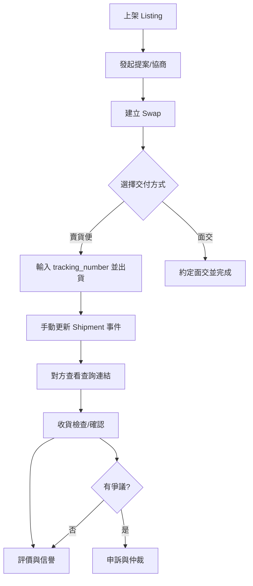
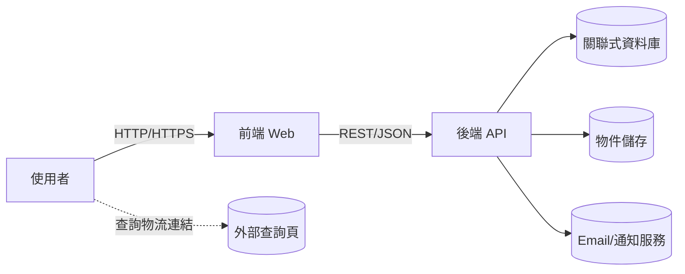

# 軟體需求分析文件（Software Requirements Specification, SRS）

產品：Exchange-Platform（明星小卡以物易物交換平台）
版本：v0.1（草案）
狀態：草擬中（依 Use Case 更新持續修訂）
文件位置：docs/software-requirements-specification.md

## 1. 簡介

### 1.1 文件目的與背景
本文件用於明確描述系統要「做什麼」，作為產品、設計、開發、測試與營運的共同依據。內容來源以 docs/use-cases 之 Use Case 為基礎，並整合近期決策（例如：物流限定與手動更新）。

### 1.2 系統概述與目標
Exchange-Platform 聚焦「明星小卡（idol photocard）」交換場景，提供使用者上架卡片、建立交換提案、協商、成立交換、出貨／面交、物流追蹤（手動維護）、收貨確認、評價與爭議仲裁等完整流程；支援收集者完成「全套」並依偏好（團體/成員/版本/時期/卡號）交換。

核心目標：
- 讓使用者可安全、透明地以物易物。
- 以清楚的流程與狀態降低爭議。
- 保持系統簡潔：物流狀態由寄件人手動維護（不做外部自動整合），且交付方式限定為「賣貨便」或「面交」。
- 嚴格無金流：平台不提供任何金錢交易或金流結算功能，亦禁止於平台內張貼價格、引導站外金錢交易或以金額作為條件。

## 2. 整體描述

### 2.1 系統環境（硬體/軟體/使用者類型）
- 使用者類型：Guest、User（註冊使用者）、Admin。
- 用戶端：現代瀏覽器（桌機/手機版響應式 Web）。
- 伺服端：RESTful API 服務；（假設）關聯式資料庫（例如 PostgreSQL）。
- 檔案儲存：（假設）物件儲存服務用於圖片/影片。
- 通知服務：（假設）Email 與推播（站內或行動推播）。

### 2.2 假設與限制
- 交付方式僅允許「賣貨便」或「面交」。
- 若為「賣貨便」，寄件人必須提供有效 tracking number；系統不自動向物流商查詢狀態，改以顯示可點擊的查詢連結給對方查詢。
- 物流狀態由寄件人手動更新（事件寫入 shipment.events，last_status 隨之更新）。
- 系統需提供爭議處理、信譽與風控機制以降低濫用。
- 無金流限制：平台不支援售賣、拍賣、押金、退款、代收代付等金流行為；UI 不提供價格/金額欄位，並在關鍵頁面提示禁止站外金錢交易。

### 2.3 依存關係
- Email 服務（註冊、通知）。
- 物件儲存（上架圖片/收貨證明）。
- 推播/通知服務。
- 外部查詢頁（若 tracking_url 指向外部查詢介面）。

## 3. 功能需求

### 3.1 Use Case 一覽（連結）
- [UC-01 註冊與登入](./use-cases/uc-01-authentication.md)
- [UC-02 建立交換清單（上架）](./use-cases/uc-02-listing-create.md)
- [UC-03 搜尋與篩選](./use-cases/uc-03-search-filter.md)
- [UC-04 發起交換提案](./use-cases/uc-04-proposal.md)
- [UC-05 交換協商（站內聊）](./use-cases/uc-05-negotiation-chat.md)
- [UC-06 交換成立與出貨](./use-cases/uc-06-exchange-shipping.md)
- [UC-07 物流追蹤（手動更新、賣貨便或面交）](./use-cases/uc-07-tracking.md)
- [UC-08 收貨檢查與完成](./use-cases/uc-08-delivery-confirmation.md)
- [UC-09 評價與信譽](./use-cases/uc-09-review-reputation.md)
- [UC-10 爭議申訴與仲裁](./use-cases/uc-10-dispute-arbitration.md)
- [UC-11 收藏與關注](./use-cases/uc-11-favorites-follow.md)
- [UC-12 黑名單與風險警示](./use-cases/uc-12-blacklist-risk.md)
- [UC-13 品況分級與參考指南](./use-cases/uc-13-condition-grading.md)
- [UC-14 自動交換配對](./use-cases/uc-14-auto-matching.md)
- [UC-15 主題交換市集](./use-cases/uc-15-themed-market.md)

### 3.2 重要功能摘要（對齊最新決策）
- 出貨（UC-06）：僅允許「賣貨便」或「面交」。賣貨便需輸入 tracking_number，系統顯示查詢連結。
- 物流追蹤（UC-07）：雙方各自為自己的 Shipment 手動新增事件、更新 last_status；不做 webhook / polling。
- 收貨確認（UC-08）：雙方完成後標記 Swap COMPLETED；逾時可自動完成（可配置）。
- 爭議（UC-10）：上傳證據、稽核、裁定與信譽影響。
 - 小卡領域支援：Listing/搜尋支援「團體、成員、專輯/時期、版本、卡號（Code）、是否官方」欄位；提案支援多卡交換以協助完成全套。

### 3.3 流程圖（Mermaid 範例）
Use Case（摘要）：

## 4. 非功能需求

### 4.1 效能
- 一般頁面 TTI（首屏互動）：≤ 2.5s（中位數，穩定網路與常見裝置）。
- API 95 分位反應時間：列表 ≤ 500ms，明細 ≤ 300ms（不含檔案上傳）。
- 併發：支援同時線上 1,000 使用者（可依階段調整）。
- 上傳：單檔 ≤ 10MB（可配置），圖片壓縮與縮圖延遲處理。

### 4.2 安全性
- 密碼雜湊（BCrypt/Argon2）、JWT/Session 管理、CSRF/ XSS 防護。
- 權限檢查：Shipment 更新僅限 owner 或 Admin。
- 日誌與稽核：關鍵操作留存（更新事件、裁定、封禁等）。

### 4.3 相容性
- 瀏覽器：最新兩版 Chrome/Edge/Safari；行動裝置相容性驗證。
- API：REST/JSON，版本化（/v1）。

### 4.4 可維護性與可移植性
- 程式與文件分層清晰；資料表與狀態枚舉集中定義（見 state-indicators.md）。
- 可移植：基於標準關聯式資料庫與 HTTP API，基礎設施可替換。

## 5. 資料需求

### 5.1 資料字典（核心）
- users(id, email, password_hash, display_name, verified, roles, risk_score, created_at, last_login)
- listings(id, owner_id, title, description, condition[S/A/B/C], photos[], status, locked_by_proposal_id)
 - listings(id, owner_id, title, description, idol_group, member_name, album, era, version, card_code, is_official, condition[S/A/B/C], photos[], status, locked_by_proposal_id, tags[])
- proposals(id, proposer_id, proposee_listing_id, proposer_listing_ids[], status, expires_at)
- messages(id, proposal_id or swap_id, from_user_id, content, attachments[], created_at)
- swaps(id, a_user_id, b_user_id, status, received_a_confirmed, received_b_confirmed, completed_at)
- shipments(id, swap_id, sender_id, delivery_method{賣貨便|face_to_face}, tracking_number?, tracking_url?, last_status, events[], shipped_at, updated_at)
- reviews(id, swap_id, reviewer_id, reviewed_user_id, scores{integrity,packing,speed,accuracy}, comment, created_at)
- disputes(id, swap_id, claimant_id, reason, evidence_refs[], status, admin_resolution, created_at)

更多狀態與枚舉值請參照：docs/use-cases/state-indicators.md。

### 5.2 資料流與儲存結構（DFD Level-0 概略）

## 6. 使用者介面需求

### 6.1 主要頁面描述
- 首頁/搜尋：搜尋列、類別/條件/物流選項篩選；列表分頁。
- 上架頁：表單（類別、標題、團體/成員、專輯/時期/版本、卡號、是否官方、品況、描述、照片上傳、物流選項）。
- 提案/協商頁：提案摘要、聊天室、加入/移除物品、同意/取消操作。
- Swap 明細：雙方資訊、兩筆 Shipment 卡片（各自的 delivery_method、tracking_number、查詢連結、last_status、歷史事件）；顯示待換與提供的小卡清單（支援多卡交換）。
- Shipment 更新面板：新增事件（狀態下拉、備註/證據上傳）、輸入/更新 tracking_number（僅賣貨便）。
- 收貨確認頁：上傳收貨證明、確認/申訴按鈕。
- 評價頁：分項評分與留言。
- 管理後台：審核上架、處理申訴、黑名單管理、風控儀表板。
- 禁止金流說明：在上架、提案、協商等頁面顯示提醒，禁止價格/金額與站外金錢交易；提供檢舉入口。

### 6.2 UI 規格重點
- Shipment 卡片需明顯顯示 delivery_method；若為賣貨便，顯示 tracking_number 與「查詢物流」按鈕（連結 tracking_url）。
- 新增事件表單需限制可選狀態並檢查狀態轉換合理性（見 state-indicators.md）。
- 面交流程提供「完成面交」雙向確認步驟。

## 7. 需求可追蹤性與驗收

### 7.1 對應矩陣（摘要）
- 功能需求 → 對應 Use Case（UC-01 ~ UC-15）。
- 狀態與欄位 → 對應 state-indicators 與 5.1 資料字典。
- 驗收 → 各 UC 內之 Gherkin 驗收標準；可轉為 E2E/整合測試腳本。

### 7.2 驗收原則
- 頁面/API 皆需滿足相應 UC 的 Gherkin；關鍵路徑（上架→提案→出貨→收貨→評價）需建立最小可行自動化驗收。

## 8. 名詞解釋（Glossary）
- Swap：交換交易，通常含雙向兩筆 Shipment。
- Shipment：寄件紀錄；擁有者為寄件人（owner）。
- 賣貨便：平台指定的物流方式；需提供 tracking_number。
- 面交（face_to_face）：雙方面對面交付，不需 tracking_number。
- tracking_number：運單編號；tracking_url：查詢連結（可外部或平台頁面）。

---

本文件為活文件，隨著 Use Case 與架構演進而更新；若與 Use Case 有出入，以最新的 Use Case 與 state-indicators 為準，並同步回寫本文件。
